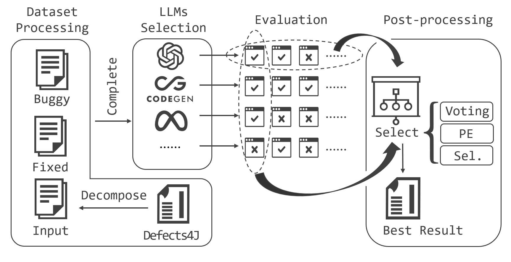
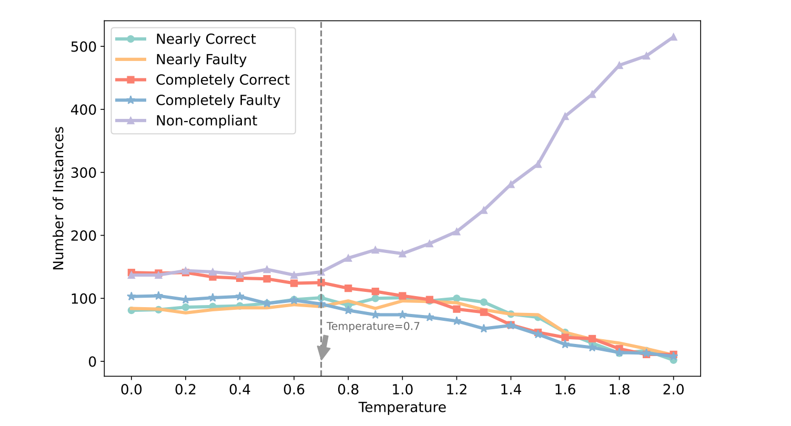
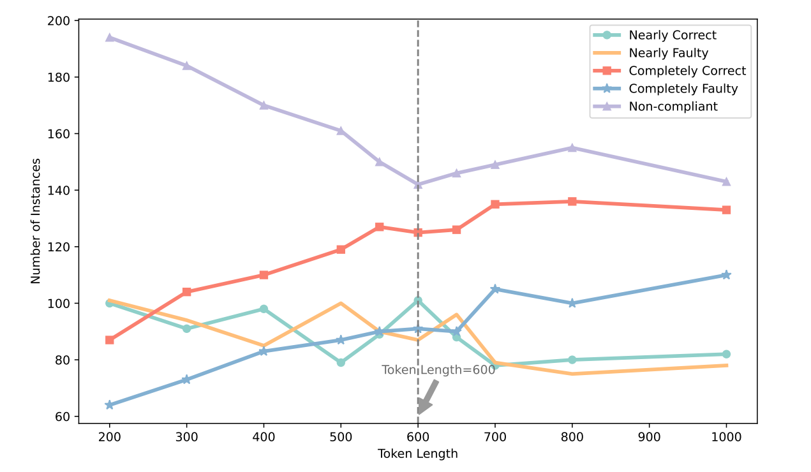
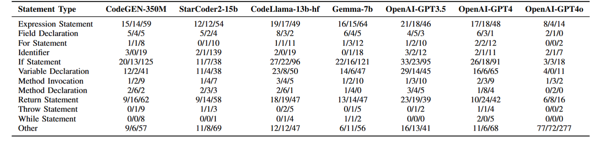
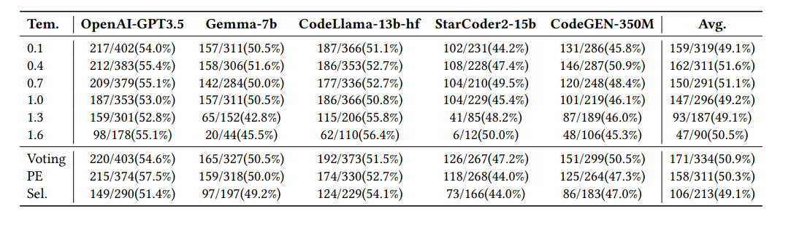
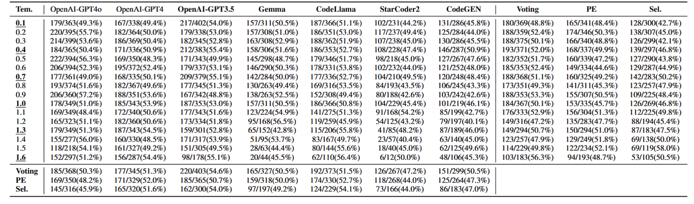

# When Large Language Models Meet Fragile Code Completion

The code for 'When Large Language Models Meet Fragile Code Completion' paper.




**Table of Contents**

1. [Introduction](#when-large-language-models-meet-fragile-code-completion)
2. [Installation Requirements](#installation-requirements)
3. [Adding a Configuration File](#adding-a-configuration-file)
4. [Dataset Download](#dataset-download)
5. [Dataset Processing](#dataset-processing)
6. [Research Questions 1](#rq1)
   - [Hyper-Parameter Tuning](#hyper-parameter-tuning)
   - [Hyper-Parameter Tuning](#hyper-parameter-tuning)
   - [Impact of Different Temperatures on GPT3.5](#exploring-the-impact-of-different-temperatures-on-openai-gpt35-code-completion-results)
   - [Impact of Different Temperatures Across LLMs](#exploring-the-impact-of-different-temperatures-on-code-completion-for-different-llms)
   - [Impact of Different Token Lengths on Code Completion](#exploring-the-impact-of-different-token-lengths-on-code-completion)
7. [Research Questions 2](#rq2)
   - [The Code Types for Completion Results from Different Models](#the-code-types-for-completion-results-from-different-models)
   - [The Code Types of the Fixed Code That Correspond to the Completed Code from Different Models](#the-code-types-of-the-fixed-code-that-correspond-to-the-completed-code-from-different-models)
8. [Research Questions 3](#rq3)
   - [The Correct Results With Post-processing Approaches (Different Models)](#the-correct-results-with-post-processing-approaches-different-models)
   - [The Correct Results With Post-processing Approaches (Different Temperatures)](#the-correct-results-with-post-processing-approaches-different-temperatures)
9. [Discussion](#discussion)
   - [Implications](#implications)


## Installation Requirements

This project uses Python 3.10.

```bash
pip install -r requirements.txt
```

## Adding a Configuration File

Add a `config.yml` configuration file in the project's root directory and fill in the necessary information for the experiment, such as the keys for OpenAI and Hugging Face.

```yml
config:
  dataset_path: C:\happen\dataset\completeOutput
openai-gpt3:
  api_base: https://api.openai.com/v1
  api_key: sk-xxx
huggingface:
  key_list:
  - hf_xxx
  - hf_xxx
```

## Dataset Download

In our study, we only used the defect data and the corresponding correct data from Defects4J. To facilitate the experiments, we organized the data from Defects4J, collated all versions of the code files, and uploaded the processed files to Google Drive. The download link is as follows: https://doi.org/10.5281/zenodo.13166287

Then unzip the data and ensure that the `dataset_path` specified in the `config.yml` file corresponds to the actual location where the data is stored after extraction.

## Dataset Processing

Run the `1.view_the_decompose_dataset.py` script to process the dataset and view the results according to the "Study Design > Dataset" section of the paper. The processed results will be cached in the project directory's cache folder. To reprocess the data, simply delete this folder.

## RQ1

### Hyper-Parameter Tuning

We notice that the hyper-parameters in the LLMs are also important and may influence the performance of them. In this section, we explore the influence on the models with different hyper-parameters. 


#### Temperature
For the temperature, we conducted additional experiments on all seven previously mentioned models. By altering the temperature parameter, we observed each model's code completion performance at various temperature settings. We show detailed results on OpenAI-GPT3.5 in Fig.1. We chose OpenAI-GPT3.5 for our preliminary experiments because of its popularity and proven effectiveness in code completion tasks. 


From Fig.1, we find that as the temperature increases, the overall number of Non-compliant instances rises, whereas correct and faulty completions decline.  This indicates that increasing temperatures induce a greater degree of variability and a reduction in precision within code completions, alongside a diminished tendency to replicate learned patterns from the training data. 
The optimal code completion quality is achieved with the temperature setting at approximately 0.7, marking the peak in completely correct completions. The rate of nearly correct completions is notably high at this setting, constituting 41.3\% of the total. Conversely, the proportion of nearly faulty code was only 32.6\%, indicating that at this temperature, the model completes code of relatively higher quality, offering more nearly correct and fewer nearly faulty completions. This may be attributed to the model's enhanced ability to balance accuracy and creativity at this temperature, thereby achieving better code completion results. The quality of code completions began to decline when the temperature exceeded 0.7. This downward trend is caused by greater divergence and randomness in outputs as temperature increases, leading to more completions that were neither accurately correct nor faulty. 
We conducted experiments on different models, and the results are shown in Fig.2. The trends observed in Fig.1 persist across the models, although the specific temperature at which peak performance is achieved varies.

In Fig.1 and Fig.2, we also find that despite the temperature changes, the previous findings remain consistent: 
1. the well-performing models in generating correct code are also prone to generating substantial incorrect outputs; 
2. their performance is closely mirrored by their ability to generate faulty outputs; and 
3. existing LLMs tend to generate a large amount of off-target, irrelevant, or completely nonsensical completions. For the finding of code memorization, we get a new observation that as the temperature increases, existing models display a decreased propensity to regenerate learned patterns from their training datasets.

#### Token Length

For the token length, we conducted additional experiments on OpenAI-GPT3.5, varying parameters including temperature and token length. Token length denotes the context's length given to the model, with a longer length implying more information in the provided request. The experimental results are shown in Fig.3. 

The results show that irrespective of token length, there is a consistent pattern of model results aligning with faulty codes, and this misalignment becomes more obvious as the token length increases. Specifically, at a token length of 600, the model finds a sweet spot, achieving an optimal balance between code completion quality and economic efficiency, with the best results achieved using fewer tokens. 
For the previous findings (Finding 1 to Finding 4), the results are still consistent.

**finding:** No matter how the temperature and token length changes, the previous findings remain consistent: 
1. the well-performing models in generating correct code are also prone to generating substantial incorrect outputs; 
2. their performance is closely mirrored by their ability to generate faulty outputs; and 
3. existing LLMs tend to generate a large amount of off-target, irrelevant, or completely nonsensical completions.

### Exploring the Impact of Different Temperatures on OpenAI-GPT3.5 Code Completion Results

> Note: This process will call the OpenAI GPT3.5 API over 10,000 times. For testing, you can modify the number of datasets returned by the `get_huge_code_list` function in `get_dataset/__init__.py` to a smaller set for testing purposes. After making changes, you need to delete the `cache` directory or just the `temp` folder below.

1. Modify the `config.yml` file to add the `api_key` for `openai-gpt3`.

2. Run the script `2.RQ1_Impact_of_Temperatures_on_GPT3.5_Code_Completion_Results.py` to see results similar to those depicted in the paper.


<p align="center"><em>Fig.1 Impact of Different Temperatures on OpenAI-GPT3.5 Code Completion</em></p>


<!-- RQ1_Impact_of_Temperatures_on_GPT3.5_Code_Completion_Results.png -->

### Exploring the Impact of Different Temperatures on Code Completion for Different LLMs

> Note: This process will call the OpenAI GPT3.5 API over 10,000 times and the HuggingFace API over 40,000 times. For testing, you can modify the number of datasets returned by the `get_huge_code_list` function in `get_dataset/__init__.py` to a smaller set for testing purposes. After making changes, you need to delete the `cache` directory or just the `temp` folder below.

1. Modify the `config.yml` file to add the `key` for `huggingface`.
2. Run the script `3.RQ1_Explore_Temperature_Impact_on_Code_Completion_Across_LLMs.py` to examine the impact of different temperatures on code completion across various LLMs as discussed in the paper.


<p align="center"><em>Fig.2 Impact of Different Temperatures on Code Completion for Different LLMs</em></p>

### Exploring the Impact of Different Token Lengths on Code Completion

> Note: This process will call the OpenAI GPT3.5 API over 5,000 times.

1. Modify the `config.yml` file to add the `api_key` for `openai-gpt3`.

2. Run the script `4.RQ1_Explore_Impact_of_Token_Lengths_on_Code_Completion.py` to examine the impact of token lengths on code completion.




<p align="center"><em>Fig.3 Impact of Different Token Lengths on Code Completion</em></p>


## RQ2

### The Code Types for Completion Results from Different Models

> Note: After completing the previous steps, this part does not require the use of any API keys.

Run the script `5.RQ2_Code_Types_for_Completion_Results_from_Different_Models.py` to obtain experimental results.


### The Code Types of the Fixed Code That Correspond to the Completed Code from Different Models

> Note: After completing the previous steps, this part does not require the use of any API keys.

Run the script `6.RQ2_The_Code_Types_of_the_Fixed_Code_That_Correspond_to_the_Completed_Code_from_Different_Models.py` to obtain experimental results.




## RQ3

> Note: This process will call the OpenAI GPT3.5 API over 30,000 times and the HuggingFace API over 40,000 times. 


### The Correct Results With Post-processing Approaches (Different Models)
Run the following three Python files to obtain the results shown in the figure below for RQ3:
- `7.RQ3_Different_Models_Post-processing_Prompt.py`
- `8.RQ3_Different_Models_Post-processing_Voting.py`
- `9.RQ3_Different_Models_Post-processing_Select.py`




### The Correct Results With Post-processing Approaches (Different Temperatures)

Run the following three Python files to obtain the results shown in the figure below for RQ3:
- `10.RQ3_Different_Temperature_Post-processing_Prompt.py`
- `11.RQ3_Different_Temperature_Post-processing_Voting.py`
- `12.RQ3_Different_Temperature_Post-processing_Select.py`


## Discussion

### Implications

The findings from this study have important implications for both the development and application of LLMs in software engineering in the realm of code completion:

**Enhanced Understanding of LLM Capabilities and Limitations** This research deepens our understanding of LLMs' capabilities and limitations in handling fragile code. Despite their proficiency in generating syntactically correct code, LLMs often do not fully grasp the semantic nuances, leading to potential errors. This dual nature underscores the need for enhanced model training that goes beyond syntactic understanding to include more robust semantic analysis.

**Need for Improved Error Handling** This study underscores the need for improved error handling in code completions, especially in fragile contexts. The high incidence of errors calls for the development of more sophisticated error detection and correction mechanisms within LLMs. There is a clear need for models that not only generate code but also evaluate and adapt their outputs based on potential logical and runtime errors.

**Refinement of Post-processing Approaches** This investigation highlights the need for refining post-processing approaches in LLM outputs. While techniques like majority voting, prompt engineering, and selective modeling have been employed to refine the outputs of LLMs, their effectiveness remains limited. The findings suggest that these techniques, although useful in increasing the reliability of completions, still fall short of significantly reducing errors. This highlights an opportunity for developing more advanced post-processing algorithms that can better discern and correct inaccuracies in model outputs.

**Practical Integration in Development Environments** This research advocates for the practical integration of enhanced LLMs with robust post-processing tools in integrated development environments (IDEs). For practitioners, such integration can significantly boost productivity and reduce error rates in real-time coding scenarios. However, the integration process must be handled with care to avoid introducing additional complexity or overhead that can detract from the user experience.


> Note: This process will call the OpenAI GPT3.5 API over 30,000 times and the HuggingFace API over 40,000 times. 


Run the following six Python files to obtain the results shown in the figure below for Discussion:
- `13.DIS_Two_Lines_Different_Models_Post-processing_Prompt.py`
- `14.DIS_Two_Lines_Different_Models_Post-processing_Voting.py`
- `15.DIS_Two_Lines_Different_Models_Post-processing_Select.py`
- `16.DIS_Two_Lines_Different_Temperature_Post-processing_Prompt.py`
- `17.DIS_Two_Lines_Different_Temperature_Post-processing_Voting.py`
- `18.DIS_Two_Lines_Different_Temperature_Post-processing_Select.py`


